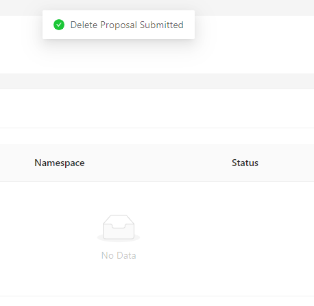

# Introduction
**This is for testing only, DO NOT USE IN PRODUCTION!**

TiDB Simple K8S Deployments Tools is a tools to help you easily manage TiDB cluster on Kubernetes. It is developed from TiDB Docker Compose, which provides basic practice on kubernets and the same logic with TiDB Docker Compose. This tools simplifies the logic of TiDB Operator. While TiDB Operator focused the full life-cycle of TiDB cluster, this tools is only focused on the deployment of a simple cluster for developers exploring the features of TiDB on Kubernetes.

# Requirements
- Docker
- Kubernetes (Cluster Admin Token for cluster management and right configured StorageClasses for data)
- *OpenEBS for storageclasses(You may use NFS or some other to provide storage service. that`s ok)
- *Kubeasz, Minikube, kind, kubeadm or some other kubernetes deployments tools.
# Quick Start
```bash
git clone https://github.com/handlerww/tidb-k8s-deployments.git
cd tidb-k8s-deployments
docker build . -t handlerww/tidb-k8s-deployments
# Ensure network port is accessable
docker run -d -p 5000:5000 handlerww/tidb-k8s-deployments
```
Then you can access the dashboard at  http://localhost:5000/.

For security purpose, tidb, grafana, prometheus network service is provided by ClusterIP. You may edit the service type in kubernetes service configuration to NodePort for development purpose, or use some Loadbalancer service to help you use the tidb and monitor it. 
# Screenshots



# Developement
TiDB Simple K8S Deployments Tools is developed by flask for backend, umijs for frontend. You can clone the code to develope it.
```bash
git clone https://github.com/handlerww/tidb-k8s-deployments.git
cd tidb-k8s-deployments
# You may use virtualenv to seperate with other development environment
pip install -r requirements.py
python index.py
```
and use these command to develope frontend. You can use unittest after you develope some new fantastic features. `index_test.py` may help you design test cases.
```bash
cd web
npm install
npm start
```
If you are working in China, cnpm may help you.
# Known Issues
- It needs a short break between you create a new TiDB cluster just after you delete last TiDB cluster. Otherwise, it will alert you that "Resources exists".
- It will destroy whole namespace after you delete TiDB cluster, it may cause your data lost. **Pay Attention**
- It use ClusterRole to monitor cluster metrics, so it may not deploy more than one cluster on 1 k8s cluster.
- It doesn`t check whether your image version exists. You may go to the offical pages to get the version infos.
- Cluster Admin Token may cause security issue.
- TiDB cluster password is empty, please set proper password before you access TiDB from public network.

# Future Works
- Fix grammer errors in introduction. XD
- Use Operator Frameworks to reconstruct the tools
- Find ways to handle issues from ClusterRoleBinding. Try to deploy more than one TiDB cluster in the same k8s cluster.
- Fix some security and accessibility issues.  
- Fix services configurations for use.
# Acknowledgments
- Thanks to TiDB-Operator[https://github.com/pingcap/tidb-operator] to provide some deployment details on kubernetes.
- Thanks to TiDB-Docker-Compose[https://github.com/pingcap/tidb-docker-compose] to provide the initial version of this tools.